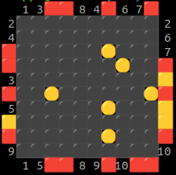

# Black Box Game

## Introduction

Black Box is a game for one player. It is played on a square grid. There are several "atoms" hidden in the grid. The player can shoot rays into the grid from the sides. If a ray directly hits an atom the ray is absorbed (HIT), if a ray only touches an atom, it is reflected according to the standard rules of reflection. The player uses the information gained from the rays to deduce the position of the atoms in the grid.

## blackbox.html

This is a simple Black Box game implementation in HTML and JavaScript. The game is played by clicking on the grid cells to shoot rays into the grid.

## BlackBox.php

This is a Black Box game generator. It generates a board with a specified size and number of atoms.

You can try generation of a board in CLI by running:
> php BlackBox.php

<pre><code>
   1 4 2🟥 3 6
 2⬛⬛⬛⬛⬛⬛ 3
🟥⬛⬛⬛🟡⬛⬛ 6
 4⬛⬛⬛⬛🟡⬛🟥
🟥⬛⬛🟡⬛⬛⬛ 7
 5⬛⬛⬛⬛⬛⬛ 7
🟥⬛⬛⬛⬛🟡⬛🟥
   1 5🟥🟨🟥🟨
</code></pre>

or specifiy the size of the board and number of atoms:
> php BlackBox.php 10 6

The game can be played online here: [Black Box Game](https://bezumie.com/blackbox)
